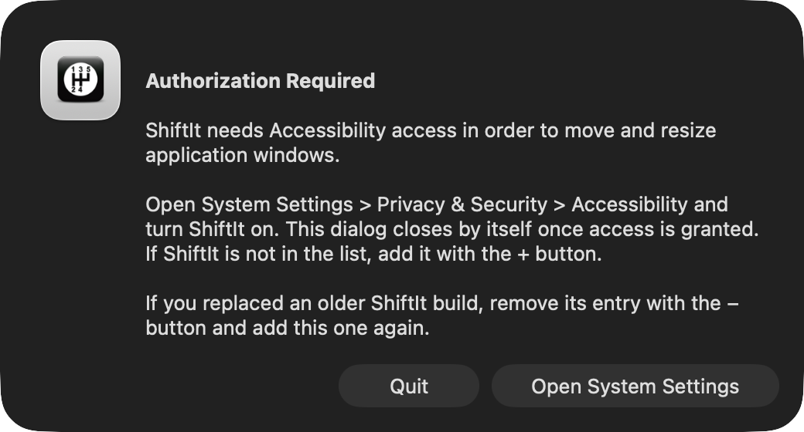
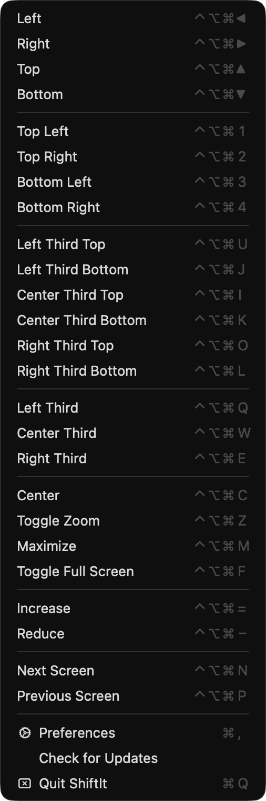
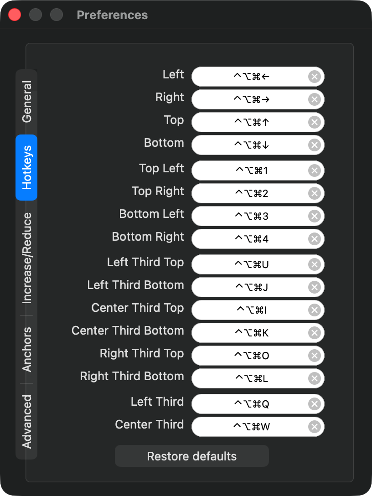

<h1> ShiftIt</h1>

*Move and resize windows on macOS with keyboard shortcuts — native on Apple Silicon*

ShiftIt snaps the focused window to halves, quarters and thirds of the screen, centers or maximizes it, grows or shrinks it, and moves it between displays.

This is a fork of [fikovnik/ShiftIt](https://github.com/fikovnik/ShiftIt), which has not been developed since 2018 and only ships an x86_64 build that runs under Rosetta. The fork builds one universal app for Apple Silicon (M1–M4) and Intel Macs on macOS 12 or newer.

**[Download the latest release](https://github.com/idkhanhvo272/ShiftIt/releases/latest)**

## Installation

1. Download `ShiftIt-x.y.z.zip`, unzip it and move `ShiftIt.app` to `/Applications`. If you already have an older ShiftIt there, replace it: your hotkeys and settings are kept.
2. The app is not notarized, so macOS blocks the first launch. On macOS 15 and later, open *System Settings › Privacy & Security*, scroll down to *Security* and click *Open Anyway*. On older versions, right-click the app and choose *Open*.
3. ShiftIt needs Accessibility access to move other apps' windows. On first launch it asks for it:

   

   Click *Open System Settings*, then turn on *ShiftIt* in *Privacy & Security › Accessibility*. The dialog closes by itself and ShiftIt restarts, ready to use.

**Upgrading from 1.6.6 or rebuilding the app:** macOS ties Accessibility access to the app's code signature, so the old *ShiftIt* entry in the list does not cover the new app even though it looks enabled. Select it, remove it with **−**, then turn on the new one.

## User guide

ShiftIt lives in the menu bar. Every action is listed in its menu together with its shortcut:



To change a shortcut, open *Preferences › Hotkeys*, click the shortcut and press the new key combination. <kbd>Esc</kbd> or <kbd>⌫</kbd> cancels the recording, the ⓧ button removes the shortcut, and *Restore defaults* brings back the original set.



The other tabs set how much *Increase*/*Reduce* change the size, the screen margins windows snap to (*Anchors*), whether the menu bar icon is shown and whether ShiftIt opens at login.

Most apps work with ShiftIt. A few apps limit their window size or ignore the Accessibility API; see the [list of known problems](https://github.com/fikovnik/ShiftIt/wiki/Application-Compatibility-Issues).

## Requirements

* macOS 12 or newer, Apple Silicon or Intel
* Accessibility access (see [Installation](#installation))

## FAQ

##### A shortcut does nothing

1. Make sure *ShiftIt* is turned on in *System Settings › Privacy & Security › Accessibility*. If it already looks enabled, remove the entry with **−** and add `/Applications/ShiftIt.app` again with **+**. This happens after replacing or rebuilding the app. Alternatively, run `tccutil reset Accessibility org.shiftitapp.ShiftIt` and relaunch ShiftIt to get the permission dialog again.
2. Check that no other app uses the same key combination. Try the action from the ShiftIt menu: if that works, the shortcut is taken; record another one in *Preferences › Hotkeys*.
3. Some apps cannot be resized or moved this way, see the [list of known problems](https://github.com/fikovnik/ShiftIt/wiki/Application-Compatibility-Issues).

##### How do I turn on/off cycling window sizes with repeated presses?

When cycling is on, pressing *Left* (and likewise *Right*, *Top*, *Bottom*) snaps the window to half of the screen, a second press to one third and a third press to two thirds. When it is off, the window stays at one half.

It can only be changed from the command line. Run the first command to turn it on, the second to turn it off:

```sh
defaults write org.shiftitapp.ShiftIt multipleActionsCycleWindowSizes YES
defaults write org.shiftitapp.ShiftIt multipleActionsCycleWindowSizes NO
```

##### I hid the menu bar icon, how do I get it back?

Launch ShiftIt again from `/Applications`: it opens the preferences, where you can turn *Show Icon In Menu Bar* back on.

##### Does it still support X11 windows?

Only when the app is built on a Mac with [XQuartz](https://www.xquartz.org) installed; the release build does not include it.

## Development

### Build and test

```sh
xcodebuild -project ShiftIt/ShiftIt.xcodeproj -scheme ShiftIt -configuration Release build
xcodebuild -project ShiftIt/ShiftIt.xcodeproj -scheme ShiftItTests test
```

The build is universal (arm64 + x86_64) and ad-hoc signed, so macOS asks for Accessibility again after every rebuild. Sign with your own certificate to keep the permission: add `CODE_SIGN_IDENTITY="Apple Development: Your Name (TEAMID)"`.

### Changes from upstream 1.6.6

* Universal arm64/x86_64 binary, macOS 12+. Hotkey dispatch casts `objc_msgSend` to its real prototype, which arm64 requires.
* The x86-only `ShortcutRecorder.framework` is replaced by its source ([Kentzo/ShortcutRecorder@0c481a6](https://github.com/Kentzo/ShortcutRecorder/tree/0c481a6), BSD) in `ShiftIt/Vendor`. Recorded hotkeys keep only ⌃⌥⇧⌘, so arrow and function keys work.
* Sparkle is removed (its appcast pointed at the upstream x86 build). *Check for Updates* opens the releases page.
* The Accessibility dialog opens System Settings, closes by itself once access is granted and relaunches ShiftIt, because `AXIsProcessTrusted()` keeps returning NO in a process that started without access.
* *Open At Login* uses `SMAppService` on macOS 13+.
* X11 support is compiled in only when XQuartz headers are installed.
* Tests run on XCTest.

### Making a release

1. Bump `CFBundleShortVersionString` and `CFBundleVersion` in [ShiftIt/ShiftIt-Info.plist](ShiftIt/ShiftIt-Info.plist).
2. Build a stripped release and zip it without extended attributes:

   ```sh
   xcodebuild -project ShiftIt/ShiftIt.xcodeproj -scheme ShiftIt -configuration Release \
     -derivedDataPath build/release DEPLOYMENT_POSTPROCESSING=YES build
   ditto -c -k --norsrc --noextattr --noqtn --keepParent \
     build/release/Build/Products/Release/ShiftIt.app ShiftIt-X.Y.Z.zip
   ```

3. Publish it: `gh release create version-X.Y.Z ShiftIt-X.Y.Z.zip --title X.Y.Z --notes-file notes.md`

`fabfile.py`, `Pipfile` and `release/` belong to the upstream Sparkle release process and are no longer used.

## Credits

ShiftIt was written by [Filip Krikava](https://github.com/fikovnik) as a rewrite of the original [ShiftIt](http://code.google.com/p/shiftit/) by Aravindkumar Rajendiran, with many contributors. Thanks to [JetBrains](http://www.jetbrains.com/) for supporting the upstream project with [AppCode](http://www.jetbrains.com/objc/).

License: [GNU General Public License v3](http://www.gnu.org/licenses/gpl.html)
